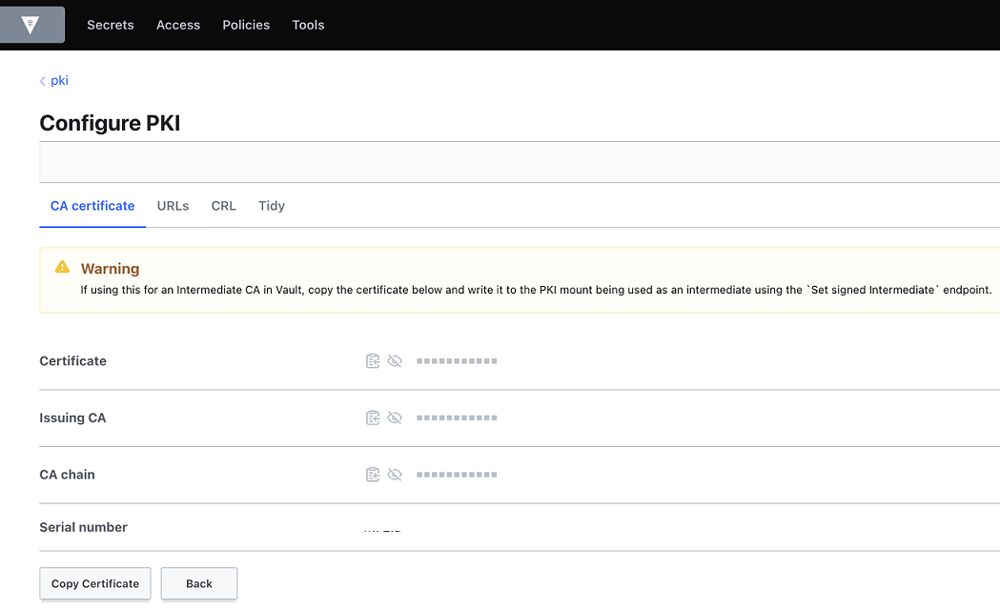

# Amazon MSK mutual TLS authentication with third-party certificate authority

Amazon MSK supports multiple authentication [mechanisms](https://docs.aws.amazon.com/msk/latest/developerguide/kafka_apis_iam.html) including IAM, SASL/SCRUM and MTLS. Customers who want to use MTLS for authentication, have to use AWS private CA as Amazon MSK only supports AWS private CA as a certificate authority. However, many customers use third-party certificate authorities like [hashicorp vault](https://www.hashicorp.com/products/vault) as a certificate authority.

In this example we will show, how Customers using third-party certificate authority (CA) can bring their own certificates for mTLS authentication with Amazon MSK. To achieve this goal, you will need to leverage AWS Private CA and create a new subordinate CA on AWS signed by your private CA.

You can follow the relevant documentation to create a new private subordinate [CA](https://docs.aws.amazon.com/privateca/latest/userguide/create-CA.html) using the console or AWS CLI. After creating a new subordinate CA, you will need to install a subordinate CA certificate signed by an external parent CA by following the procedure documented [here](https://docs.aws.amazon.com/privateca/latest/userguide/PcaExternalRoot.html).

Once you have obtained the certificate signing request (CSR), and you have access to an external signing authority, you can submit the CSR to your external signing authority and obtain a signed CA certificate along with any chain certificates. 

In the below example, we are using Hashicorp Vault PKI Secrets [Engine](https://developer.hashicorp.com/vault/docs/secrets/pki) as an external signing authority to obtain a signed CA certificate based on the CSR.
Specifically, we can use the “Sign intermediate” feature (or the corresponding CLI commands) to obtain this certificate:

Once signed, you can copy the certificate and the CA chain, and subsequently import the private CA certificate file and the chain file into AWS Private CA. 

## Creating a subordinate CA using AWS Private Certificate Authority
1. Go to AWS Private Certificate Authority [console](https://us-east-1.console.aws.amazon.com/acm-pca).
2. Select Create a private CA.
3. Choose CA type as Subordinate.

4. Update distinguished name, Key algorithm and *create CA*.
5. Select the CA you created and select Install CA certificate.

6. Select External private CA as CA type, copy the certificate body and certificate chain from your private CA (in this example Hashicorp Vault).

7. Select Confirm and install.

## Configure your MSK cluster for Mutual TLS authentication
To use the CA you created earlier follow the below steps:
1. Select your MSK cluster, go to *Properties* and Edit the *Security settings*.
2. Select *TLS client authentication through AWS Certificate Manager (ACM)* as access control methods and choose the Subordinate CA you created earlier and *Save changes*.

## Test your client
Once you finish updating the security settings for your MSK cluster, follow [Mutual TLS authentication](https://docs.aws.amazon.com/msk/latest/developerguide/msk-authentication.html#msk-authentication-client) documentation to test your client.

